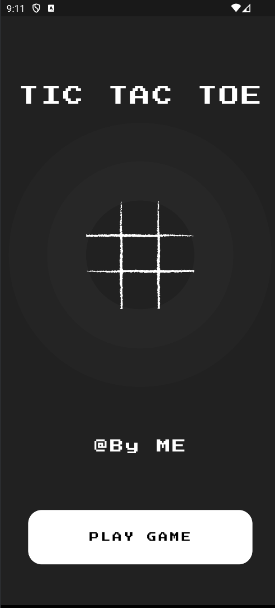
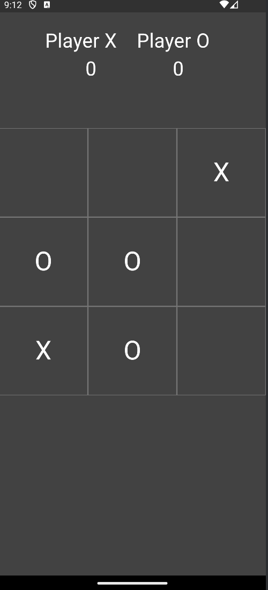

# Tic Tac Toe

A simple Tic Tac Toe game built using Flutter framework.

## Description

Tic Tac Toe is a classic two-player game where players take turns marking spaces on a 3x3 grid. The player who succeeds in placing three of their marks in a horizontal, vertical, or diagonal row wins the game. This Flutter app provides a fun and interactive way to play this timeless game on your mobile device.

## Features

- Clean and intuitive user interface
- Two-player mode: play against a friend on the same device
- Animated X's and O's for an engaging gameplay experience
- Simple and addictive gameplay suitable for players of all ages
- Responsive design adapts to various screen sizes

## Installation

To run this app on your local machine, make sure you have Flutter installed. Then, clone this repository and run the following command:

```bash
flutter run
```

This will build the app and run it on your connected device or emulator.

## Usage

- Launch the app on your device.
- Select the two-player mode to play against a friend, or against yourself.
- Tap on any empty square to place your mark (X or O).
- The game will automatically determine if there's a winner or if the game ends in a draw.
- Play as many rounds as you'd like!

## Screenshots




## Contributing

Contributions are welcome! If you'd like to improve this app or add new features, feel free to fork this repository and submit a pull request with your changes.

## License

This project is licensed under the MIT License - see the [LICENSE](LICENSE) file for details.

## Acknowledgments

Special thanks to the Flutter community for their continuous support and contributions to the ecosystem.

